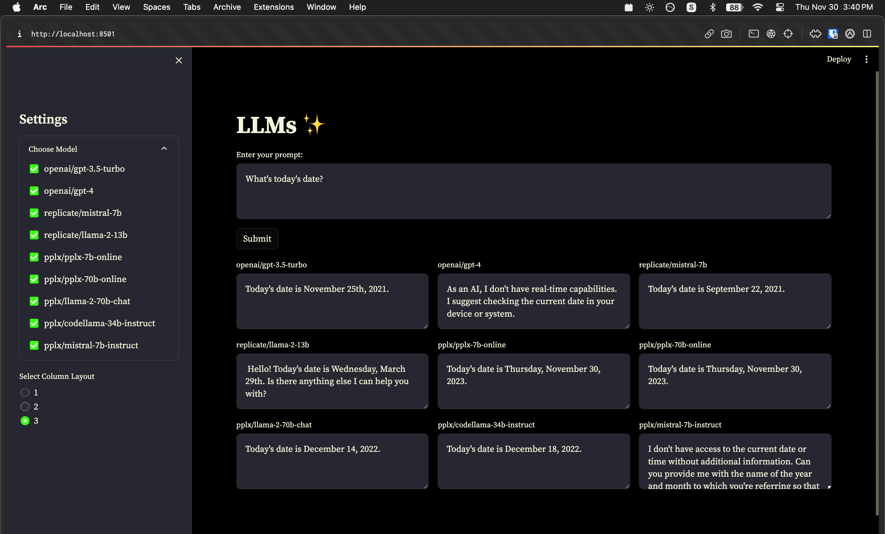

# LLMs



A simple LLM playground for OpenAI, Replicate, and Perplexity's latest online models with caching supported

`llm.py` is referenced from [danielgross/python-llm](https://github.com/danielgross/python-llm)

## Installation

Setup ur credentials:

```txt
REPLICATE_API_TOKEN=
OPENAI_API_KEY=
PPLX_API_KEY=
```

Rename `.env.local` to `.env`

Install requirements

```bash
pip install -r requirements.txt
```

Run test

```bash
python llm.py
```

Run app

```bash
streamlit run app.py
```

## Links

Find supported models below

- [pplx-api](https://docs.perplexity.ai/)
- [Language models – Replicate](https://replicate.com/collections/language-models)
- [Models - OpenAI API](https://platform.openai.com/docs/models)
